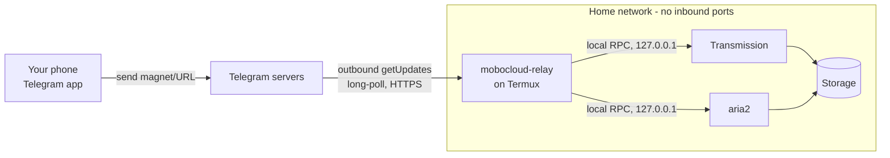

# mobocloud-relay

A private Telegram bot that lets you trigger downloads on your Termux Android
home server from anywhere — no VPN, no port forwarding, no public IP, no
inbound connection to your home network at all.

Send a magnet link or a URL to your bot from your phone. It reaches your
server outbound over the internet, gets picked up by a background process
polling Telegram from inside your home network, and is handed to your
existing Transmission or aria2 install over their local RPC APIs.

## What this is (and isn't)

- It **is** a small Python process that polls the Telegram Bot API and calls
  Transmission/aria2 RPC. Nothing else.
- It **is not** a general remote-shell, a file browser, or a way to run
  arbitrary commands on your phone. It never executes Telegram message
  content as a shell command.
- It does **not** open any port on your router, register a dynamic DNS name,
  or run a VPN/tunnel of any kind.

## Architecture



The bot only ever **initiates** connections outward (to `api.telegram.org`).
Your router never needs to accept a connection from the internet — there is
nothing to forward, tunnel, or expose. This is the same reason "a phone can
receive WhatsApp messages without you configuring your router" works: the
client polls out, the server never dials in.

### Why no VPN / tunnel / port forwarding

Those solutions all solve "let the internet reach a service running at home."
This project sidesteps the problem entirely: the *service* (Telegram's own
infrastructure) is already reachable from anywhere, and your phone only talks
to it outbound. There is no scenario here where an inbound connection to your
home network is required, so there's nothing for a VPN/tunnel to bridge.

### How Telegram communication works

The bot calls Telegram's `getUpdates` method in a loop with a long-poll
timeout (`timeout=30`). Telegram holds the HTTP connection open and responds
as soon as a message arrives (or after the timeout with an empty list). The
bot then calls `sendMessage` to reply. No webhook, no inbound HTTPS server,
no TLS certificate to manage.

### How Transmission RPC works

Transmission speaks a JSON-over-HTTP protocol on a local port (commonly
`9091`) under `/transmission/rpc`. It requires a session ID header
(`X-Transmission-Session-Id`) which the server hands you via a `409` response
on the first request; the client then retries with that header. This project
implements that handshake directly with `urllib` — no `transmission-remote`
subprocess calls, no shelling out.

### How aria2 RPC works

aria2 exposes a JSON-RPC 2.0 endpoint (commonly port `6800`). Every call
includes `rpc-secret` as a `token:...` parameter if your install has one
configured. This project calls `aria2.addUri`, `aria2.tellActive`,
`aria2.pause`, `aria2.unpause`, and `aria2.remove` directly.

## Security model

- **Allowlist, not obscurity.** Every incoming Telegram update is checked
  against `AUTHORIZED_CHAT_IDS` *before* any command parsing happens.
  Unrecognized chat IDs get silently ignored — no reply, no hint the bot
  exists or is even a bot.
- **No shell execution, ever.** Message text is only ever used as a URL/magnet
  string passed to an RPC client, or matched against `/command` patterns.
  There is no `subprocess(..., shell=True)` anywhere in this codebase, and no
  code path constructs a shell command from Telegram input.
- **Secrets stay outside the repo.** All credentials live in a `KEY=VALUE`
  file outside git (see Installation), loaded at runtime, never logged.
- **Idempotent processing.** The last processed Telegram `update_id` (plus a
  short history) is persisted to disk, so a crash/restart/reboot never
  resubmits the same download twice.
- **Crash-only design.** Unhandled errors in a single message's handling are
  caught and reported to the chat; network failures use exponential backoff;
  if the process does die outright, `runit` restarts it automatically.

## Installation on Termux

Prerequisites already assumed (per your existing setup): `runit`/`sv`,
Transmission and aria2 running as `sv` services with RPC enabled, Python 3.

```bash
# 1. Clone the repo somewhere on the device, then deploy it under $PREFIX/opt
git clone https://github.com/<your-username>/mobocloud-relay.git
mkdir -p "$PREFIX/opt"
cp -r mobocloud-relay "$PREFIX/opt/download-bot"

# 2. Create your local, git-ignored config file
mkdir -p ~/.config/download-bot
cp "$PREFIX/opt/download-bot/.env.example" ~/.config/download-bot/download-bot.env
chmod 700 ~/.config/download-bot
chmod 600 ~/.config/download-bot/download-bot.env
nano ~/.config/download-bot/download-bot.env   # fill in real values (see below)

# 3. Install the runit service (mirrors this repo's service/download-bot/ layout)
ln -s "$PREFIX/opt/download-bot/service/download-bot" "$PREFIX/var/service/download-bot"

# 4. Start it
sv up download-bot
sv status download-bot
```

To find the values for `download-bot.env`, read your own Transmission
`settings.json` (`rpc-port`, `rpc-username`, `rpc-password`,
`rpc-bind-address`) and your aria2 config (`rpc-listen-port`, `rpc-secret`).
Both are typically bound to `127.0.0.1`/local interfaces already — this
project does not change that, and does not need those ports reachable from
outside your phone.

## Telegram bot creation (BotFather)

1. In Telegram, message **@BotFather**.
2. Send `/newbot`, follow the prompts (choose a name and a `...bot` username).
3. BotFather gives you a token like `123456789:AAExampleTokenDoNotShare`.
   This is your `TELEGRAM_BOT_TOKEN` — a secret. Anyone with it can control
   your bot's Telegram identity (not your server directly — that's what the
   chat-ID allowlist below is for).
4. Optionally send `/setprivacy` → select your bot → `Disable`, so it can see
   plain messages (not just `/commands`) in group chats. Not required for
   direct one-on-one messages, which is the intended use here.

**Terminology, and which values are secret:**

| Value | What it is | Secret? |
|---|---|---|
| Bot username (`@your_bot`) | Public handle people use to open a chat with your bot | Not secret, but don't rely on it being hidden |
| Bot token | Credential that lets *anyone* send messages as your bot / read updates | **Secret** |
| Telegram user ID | A number identifying *you* across all of Telegram | Treat as personal — this is what goes in `AUTHORIZED_CHAT_IDS` |
| Chat ID | A number identifying a specific conversation (for a 1:1 DM with the bot, it equals your user ID) | Same as above |

## Finding your Telegram numeric ID

Message **@userinfobot** (or **@RawDataBot**) on Telegram — it replies with
your numeric user ID. That number is what you put in `AUTHORIZED_CHAT_IDS`.
You never need to type the bot token or your ID into any web form.

## Configuring authorized users

Edit `AUTHORIZED_CHAT_IDS` in your local `download-bot.env`:

```
AUTHORIZED_CHAT_IDS=123456789
```

To add another person, get their numeric ID the same way and add it
comma-separated:

```
AUTHORIZED_CHAT_IDS=123456789,987654321
```

Then `sv restart download-bot` to pick up the change.

## Starting / stopping the service

```bash
sv up download-bot       # start (and enable auto-restart supervision)
sv down download-bot     # stop
sv status download-bot   # check status
sv restart download-bot  # restart (e.g. after editing the env file)
```

Logs live under `$LOGDIR/sv/download-bot/current` (same `svlogd`-based
rotation as your other services — bounded size, old files pruned
automatically).

## Available commands

| Command | Effect |
|---|---|
| `magnet:?...` or any `http(s)://` link | Auto-detected and added to the right backend |
| `/t <magnet-or-url>` | Force-send to Transmission |
| `/a <url>` | Force-send to aria2 |
| `/status` | Live health check of Transmission, aria2, Jellyfin, and disk space |
| `/downloads` | Active downloads across both backends |
| `/disk` | Storage usage |
| `/transmission` | List Transmission torrents |
| `/aria2` | List aria2 downloads |
| `/pause <id>` | Pause a Transmission torrent (numeric id) or aria2 download (gid) |
| `/resume <id>` | Resume one |
| `/remove <id>` | Remove one |
| `/start`, `/help` | Usage summary |

## Android battery / background execution

- **Termux:Boot**: if installed, add `sv up download-bot` to your
  `~/.termux/boot/start-server.sh` (alongside your other services) so the bot
  comes back after a phone reboot. This project does not install Termux:Boot
  for you — it's an existing mechanism your other services already rely on.
- **Battery optimization**: exclude the Termux app from Android's battery
  optimization (Android Settings → Apps → Termux → Battery → Unrestricted).
  Without this, Android may suspend Termux's background processes,
  interrupting the long-poll connection.
- **`termux-wake-lock`**: prevents the CPU from deep-sleeping while Termux is
  backgrounded. This has a real battery cost, which is why it's opt-in rather
  than something this project forces on you — if your server is already
  plugged in / always-on, the tradeoff is easy; on battery, weigh it against
  how quickly you want downloads to start. Your existing boot script already
  acquires a wake-lock for the other services, so if that's already the case
  for your setup, the bot benefits from it for free.
- **Wi-Fi sleep policies**: some Android builds aggressively throttle Wi-Fi
  when the screen is off. If the bot seems to "miss" messages for long
  stretches, check your Wi-Fi power-saving settings.

## Troubleshooting

| Symptom | Likely cause | Fix |
|---|---|---|
| Bot never replies to anything | `AUTHORIZED_CHAT_IDS` doesn't include your ID | Re-check via @userinfobot; the bot ignores unknown chats *silently* by design |
| `Configuration error` on startup, then exits | Missing/invalid `download-bot.env` | Check `sv status download-bot` isn't flapping; check `$LOGDIR/sv/download-bot/current`; verify file permissions are `600` |
| "Transmission could not add this" | Wrong RPC URL/credentials, or Transmission down | Verify with `curl -u user:pass http://127.0.0.1:9091/transmission/rpc` locally |
| "aria2 could not add this" | Wrong `rpc-secret` or aria2 down | Verify with a direct JSON-RPC `curl` call |
| `/status` shows a backend as DOWN but it's running | RPC bind address/port mismatch in your env file | Re-check against your actual `settings.json` / `aria2.conf` |
| Downloads work but bot stops responding after a while | Wi-Fi/battery suspending Termux | See Battery section above |
| Duplicate torrent added twice | This project already dedupes via Transmission's own `torrent-duplicate` response; aria2 has no built-in dedupe, so re-sending the same URL will queue it twice by design |

## Development / setup instructions

```bash
git clone https://github.com/<your-username>/mobocloud-relay.git
cd mobocloud-relay
python3 -m venv .venv && source .venv/bin/activate   # or the Windows equivalent
pip install -r requirements.txt
PYTHONPATH=src pytest tests/ -v
```

Runtime code (`src/download_bot/`) uses only the standard library
deliberately, to stay lightweight on Android; `requirements.txt` only
contains test tooling.

## Contributing

Issues and PRs are welcome. Please:
- Keep runtime dependencies at zero beyond the standard library unless there's
  a concrete, unavoidable need.
- Add/extend tests under `tests/` for any behavior change (they run without a
  real Termux device — RPC calls are mocked).
- Never include real tokens, chat IDs, IPs, or hostnames in commits, tests, or
  examples — use the patterns already in `.env.example` and the test files.

## License

MIT — see [LICENSE](LICENSE).
