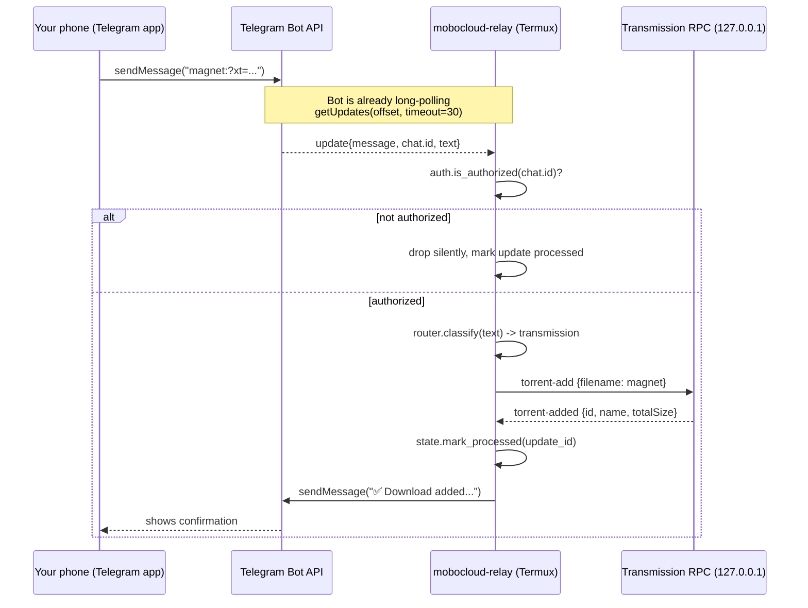

# Request lifecycle

This traces a single "send a magnet link" round trip end to end.

Every arrow that crosses the home network boundary in the diagram above is
either (a) Telegram-to-bot, which is the response to a connection the bot
itself opened, or (b) bot-to-RPC, which never leaves `127.0.0.1`/the LAN.
Nothing in this flow requires an inbound connection from the public internet.

# Module map

- `telegram_client.py` — `getUpdates`/`sendMessage` over `urllib`, no webhook.
- `auth.py` — the allowlist gate, applied first, always.
- `router.py` — magnet/URL classification; raises on anything unrecognized
  instead of guessing.
- `backends/transmission.py`, `backends/aria2.py` — thin RPC clients, one
  method per action, no shell involvement.
- `commands.py` — one function per `/command`, each composing backend calls +
  `formatting.py` templates.
- `state.py` — crash-safe, atomic (`os.replace`) persistence of the Telegram
  offset and a recent-update-id ring buffer, for idempotent restarts.
- `main.py` — the long-poll loop: backoff on network failure, per-update
  exception isolation, and the command dispatch table.
